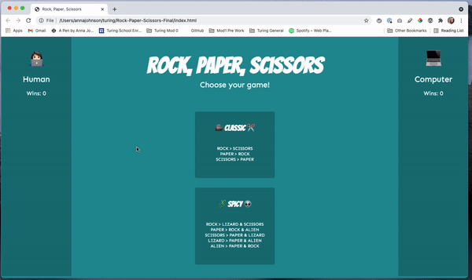

# Mod 1 Final Solo Project
## Rock, Paper, Scissors!

#### Overview
This is a Rock, Paper, Scissors game that allows users to battle a computer player in two versions of the game, Classic & 🌶  Spicy 🌶! If you have to take a break, not to worry! The game will save your wins.

In this project, I was instructed to use the Data Model to build out the functionality of both game options. As you'll see, all DOM manipulation is located in the main.js file while all game functionality is housed within game.js and activity.js files. Fancy! 🎀

#### Languages & Libraries
HTML
CSS
JAVASCRIPT

#### File Architecture
*assets* -- This is where all assets used in this web app or in this README live.
*player.js* -- This is the framework for both players, the human user and the computer.
*game.js* -- This is the game board! All functionality of the game lives here.
*main.js* -- DOM functionality! This is where the magic, that the user sees, lives.
*index.html* -- This is where all of the html lives! 💀
*styles.css* -- This is where all of the styling lives. 👗

#### Local Installation
I know you just can't wait to play! Go ahead and follow the handy steps below for installing this app.

Open your Terminal and navigate to the directory you would like to store this web app inside of.

Once you are in the directory, execute the following commands:

`git clone git@github.com:annnuuuh/Rock-Paper-Scissors-Final.git`

`cd Rock-Paper-Scissors-Final`

`open index.html`

Ready, get set.... BATTLE!
